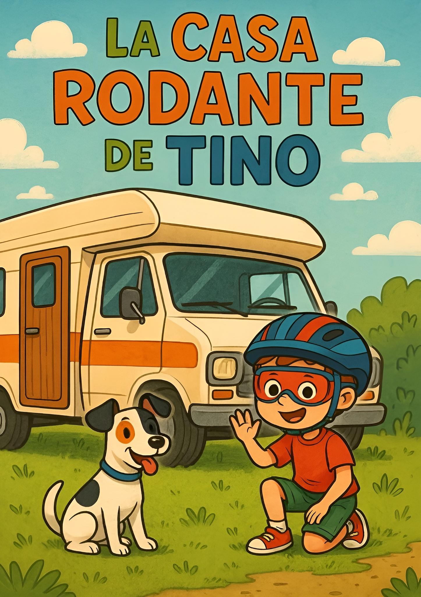
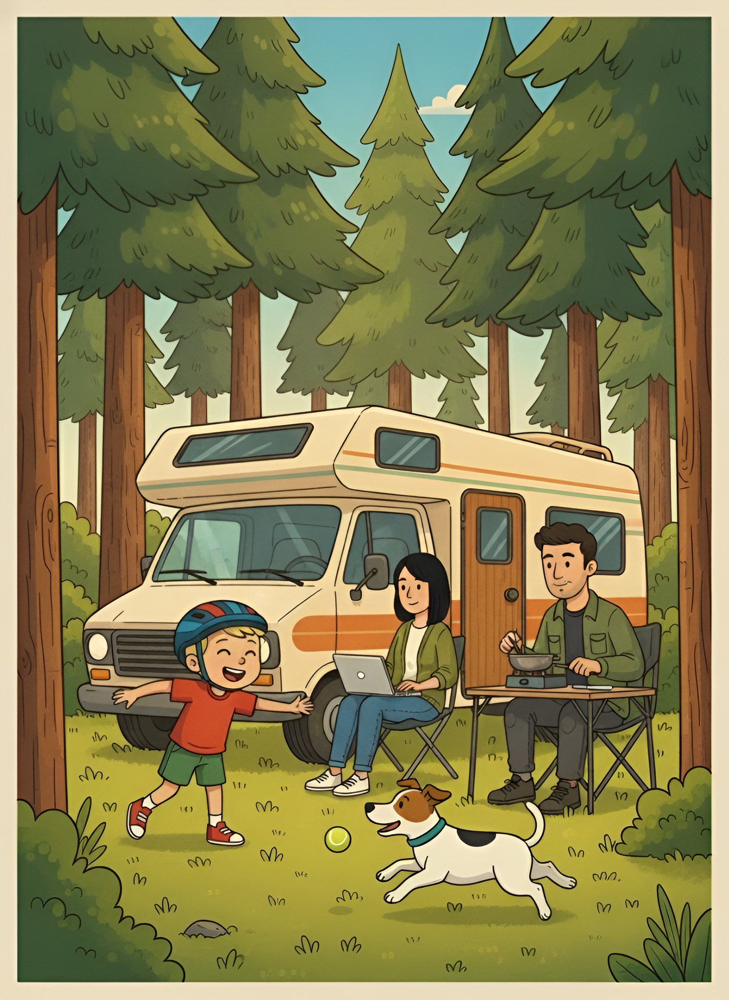
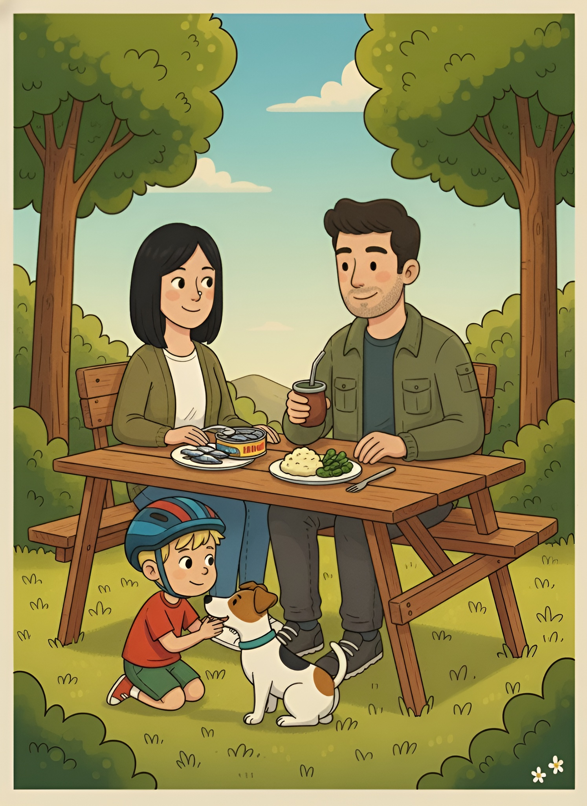
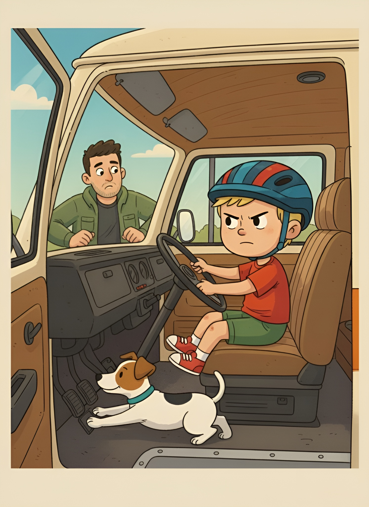
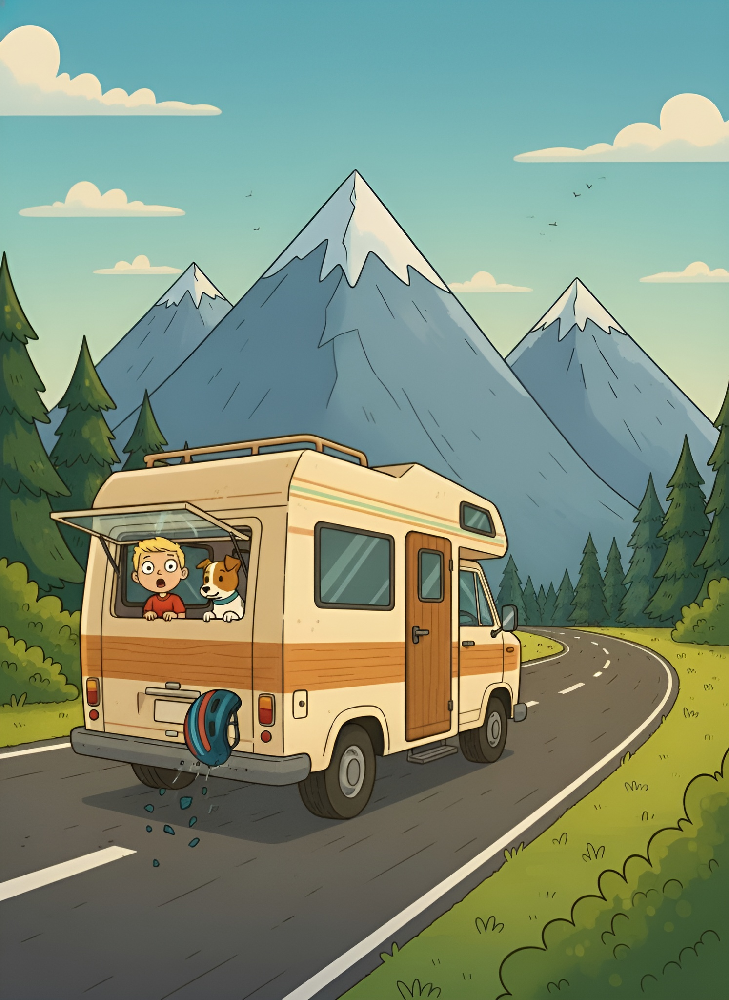
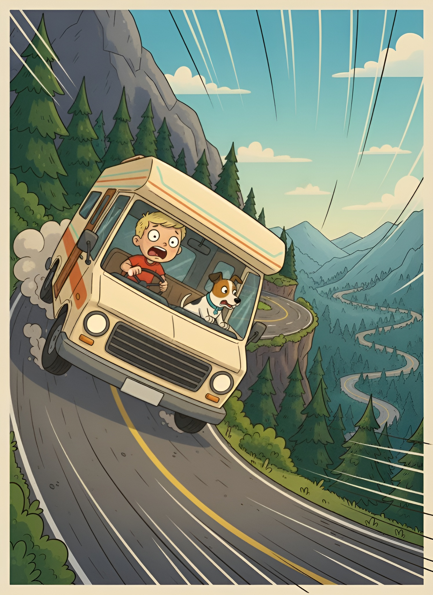
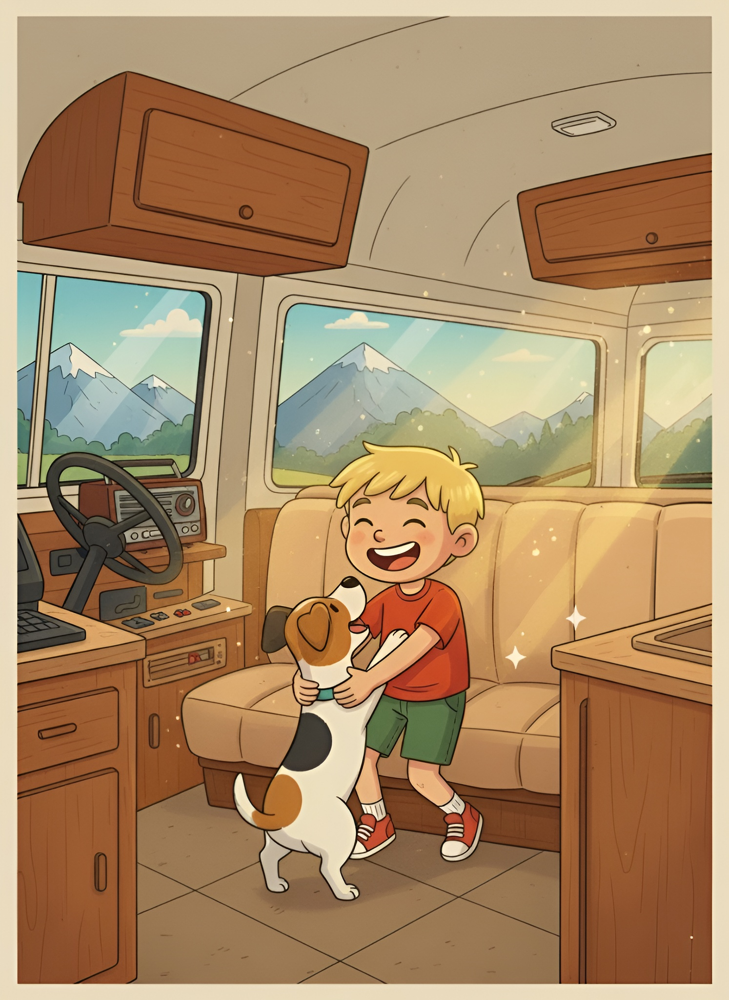
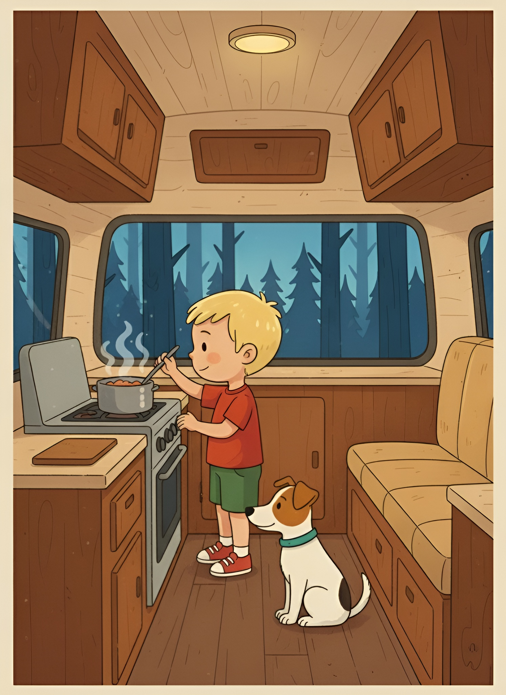
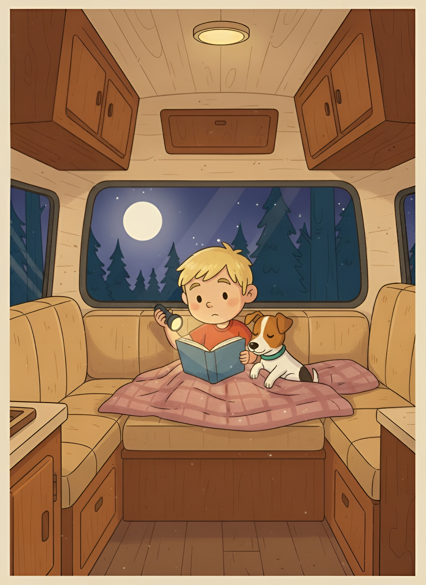
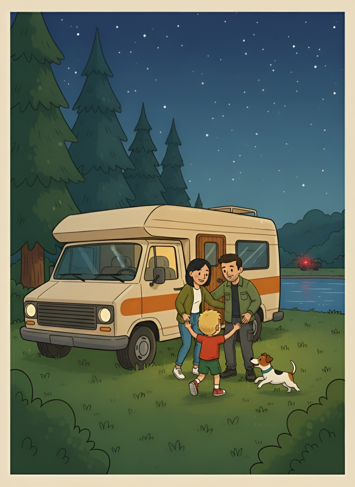

# La casa rodante de Tino

---

---

Maximiliano Rodríguez Vecino

---

© Hecho entre los meses de abril y octubre de 2025\.

---

*Para Valentino, con amor*

---

## Capítulo 1

Tino lleva puesto el casco para la bicicleta, pero no está montado en ella. Nunca se lo saca porque teme perder las ideas. Tino coloca el mapa sobre sus piernas y lee en voz alta a Pax los nombres de los países y sus capitales. Pax es un perro bodeguero con manchas blancas y negras que viaja tirado panza arriba en el asiento trasero de la casa rodante que se llama: La titi.

---

---

La titi trepa y desciende por los senderos de los Pirineos españoles. La familia va de camino a Andorra, un pequeño país entre España y Francia. Su madre va conduciendo y su padre en el asiento del acompañante, cebándole mate. Entre ellos hablan y Tino no puede escucharlos porque tienen prendida la radio.

---

---

Tino suelta un momento el mapa, se gira para mirar al perro y dice:

—¡Pax, despierta! Si te dormís ahora por la noche vas a ladrar mucho y después no me vas dejar dormir.

Pax abre los ojos, se sienta, le da un lengüetazo en el brazo y vuelve a echarse.

Tino bebe un sorbo de agua y con el dedo recorre el contorno de Sudamérica.

Cuando la música se apaga, el padre se gira y le pregunta:

—¿Tino, tenés hambre?

—Sí, papá, mucha —responde Tino, tocándose la panza.

Pax ladra y mueve la cola.

—En un rato paramos —dice la madre, sonriendo por el espejo.

—¿Vamos a comer fideos? —pregunta Tino.

—No, hoy vamos a comer verduras y pescado.

—¡Qué rico! —dice Tino, aplaude y luego acaricia a Pax.

---

Tino mira por la ventana y ve cientos de montañas con los picos muy blancos. La nieve continúa en lo más alto de los Pirineos aunque sea verano. Se escucha que el motor de La titi está rugiendo más fuerte. 

También se oyen los ruidos de los platos, de los vasos y de los cubiertos que se mueven por la vibración del motor y los pozos del camino. La titi trepa por una carretera llena de rocas y curvas. Cuando la casa rodante pasa por la curvas, Tino mira por la ventana y desde ahí ve la altura. 

Cuando era más chiquito, Tino tenía vértigo; las curvas le daban mucho mareo. Tino piensa que desde que usa el casco se le fueron todos los miedos.

---

Al llegar a la cima, la madre estaciona la casa rodante en un área con mesas entre pinos. Desde allí se pueden ver las otras montañas. Son enormes, es un lugar muy alto. Los cuatro ven a través del parabrisas las granjas sobre la enorme pastura. También pueden oír los cencerros de las vacas lecheras, las ovejas y cabras. La madre le dice a Tino que se desabroche el cinturón. Tino obedece y también desprende el arnés de Pax. Su padre se levanta y saca de una caja una vieja pelota de tenis que le entrega a Tino.

—Juega un rato con Pax —le dice el padre.

Tino abre la puerta y sale corriendo junto al perro. La madre de Tino se va a una de las mesas con su computadora. Ella trabaja y, al mismo tiempo, los vigila. Es un lugar tranquilo. No pasan autos. Solo se oye el viento y el canto de los pajaritos. Tino lanza la pelota y Pax corre a buscarla. Pax corre más deprisa cuando tiene que entregarle la pelota de nuevo. Cada vez que Pax trae la pelota, Tino le da pequeños pedacitos de comida a Pax, que mueve la cola feliz. Ambos corren de un lado para el otro hasta que se escucha:

—¡La comida ya está lista, Tino! ¡Andá a quitarte el casco y a lavarte las manos!

---

---

Tino aprieta la pelota en un puño y sale corriendo en dirección a La titi. 

Cuando va a subir el escalón de la puerta lateral de la casa rodante, se cruza con el padre que carga con los cubiertos, platos y vasos. Tino entra al baño. Se mira al espejo. Tiene la cara roja y sudada. Posa la mano sobre el casco rojo y azul, pero no se lo saca. Se lava la cara y luego las manos con agua y jabón. Después, se seca. Corre a la mesa. Su padre está sirviendo una deliciosa sardina con puré de papas y zanahorias. Y también hay un plato con brócoli y champiñones. La madre, que estaba en una videollamada de trabajo, se despide de su compañero y cierra la computadora portátil.

---

---

Tino come con apetito. Pax está al lado, en el suelo. Cada poco tiempo, sin que su madre y padre se den cuenta, le da trozos de comida a Pax. Los mayores hablan de los lugares que quieren conocer en Andorra. Le preguntan a Tino si sabe cuál es la capital. Tino tiene la boca llena, asiente y toma agua fría.

—Papá, la capital de Andorra es como mamá. La capital es Andorra la Vieja —dice Tino y señala a la madre sonriendo.

Todos ríen a carcajadas.

—¡Qué inteligente y pícaro que es mi hijo! —dice la madre.

—Mamá, yo no soy inteligente —Tino señala con un dedo su cabeza—. Es el casco el que tiene superpoderes y me pasa sus ideas.

—Tino, ya te explicamos que el casco no pasa las ideas. Al casco solo lo tenés que usar para andar en bicicleta. El casco se usa por si un día tenés un accidente, para que cuando caigas, no te des un golpe en la cabeza.

—Tino, tu madre está diciendo la verdad. Tenés que sacarte el casco para seguir comiendo.

Tino suelta los cubiertos. Cierra los ojos. Aprieta los puños. Pax lo mira. Tino vuelve a abrir los ojos y, mirando a su madre y a su padre, dice:

—Cuando era más chiquitito me dijeron que si me quitaba el casco se me irían las ideas. Yo me lo quería sacar y siempre me decían lo mismo, así que no me mientan más, por favor.

—Amor, es verdad que te dijimos eso. Pero lo hicimos porque tenías una pequeña malformación en la oreja y lo necesitabas para protegerte. Lo había dicho la doctora. Tino, era el tratamiento que tenías que seguir. Pero ahora no, ya tenés 7 años. Ya sabés leer, sabés las capitales de casi todos los países, sabés alimentar a Pax, sabés inglés y portugués. Amor, no tengas miedo, tus ideas no se van a ir porque ya no estás enfermo. Es mejor que te saqués el casco y solo lo uses cuando des paseos con la bicicleta.

—¡No, no es verdad! Si me sacan el casco me quedaré sin ideas. Y yo no quiero ser un niño bobo, quiero seguir aprendiendo los países y las capitales, porque cuando sea grande quiero dar la vuelta al mundo —dice Tino y se levanta de la silla.

Su madre y el padre lo miran. Tino pone las manos en la hebilla del casco. Le cuesta respirar. Sus manos tiemblan. De todas formas, suelta la hebilla y se quita el casco. Caen lágrimas de sus ojos. Toca a Pax, le hace seña de que lo siga. Su padre y la madre se miran durante un segundo. El padre, al ver que Tino está corriendo hacia la casa rodante, se levanta y le grita:

—¡Tino, volvé! Aún no te preguntamos las capitales de los países de Sudamérica. ¿Sabés cuál es la capital de Uruguay? ¿La sabés? ¿Sabés en qué departamentos nacimos nosotros? ¡Tino, no te vayas, tenés que terminar los deberes!

Tino abre la puerta de La titi, espera que suba Pax y cierra de un portazo.

---

## Capítulo 2

La madre y el padre quedaron en la mesa, discutiendo cómo lograr que no vuelva a usar el casco. Uno propone esconderlo; el otro duda de que esa sea la solución. La madre se lleva una mano a la frente. El padre la abraza e intenta animarla.

Adentro de La titi, Tino se mira en el espejo del baño los ojos rojos y vidriosos. Pax lame su pierna. Niega con la cabeza. Se lava la cara rápidamente y le dice a Pax que lo siga. Tino cruza el salón de la casa rodante y llega al llavero. Agarra la llave de La titi. Mira por la ventana y ve que la madre y el padre siguen en el mismo lugar comiendo manzanas. Tino camina hasta el asiento del piloto y, al sentarse, se da cuenta que no llega a los pedales.

—Pax, cuando yo prenda el motor vos apretá el acelerador que nos vamos a dar la vuelta al mundo. Es el pedal de la derecha —dice Tino.

Pax lo mira y se coloca debajo de los pies de Tino, frente a los pedales de la casa rodante.

—A la cuenta de tres, Pax. ¡Uno, dos y tres! —grita Tino y se enciende la casa rodante.

Pax pisa el acelerador y la casa rodante arranca. Tino gira el volante para entrar en la carretera. El padre corre al lado de la ventana del acompañante y grita:

—¡Tino, por favor, frena! ¡Es peligroso!

---

---

Tino mira al padre y luego las líneas de la carretera. La titi ruge y tira bocanadas de humo negro. Tino vuelve a mirar al padre. No sabe muy bien qué hacer. Le sudan las manos y la frente. La titi circula cada vez más rápido. Pax apoya dos patas en el acelerador, dejando el pedal apretado al máximo.

—Pax, ahora cambia al pedal de la izquierda.

Pax suelta el acelerador y aprieta el embriague. Tino agarra la palanca de cambios y pone la segunda marcha, y grita:

—¡Pax, ahora al acelerador, rápido!

Pax suelta el embriague y vuelve al pedal de la derecha, al del acelerador. La titi cada vez va más rápido. El padre corre al lado de la casa rodante, intenta abrir la puerta, da golpes en el vidrio, pero no puede: está bloqueada. Tino solo mira la carretera y le grita a Pax de nuevo:

—Pax, suelta el acelerador rápido y aprieta el embriague de nuevo.

---

Pax pisa otro pedal y Tino cambia a la tercera marcha. La titi sale con más fuerza y el padre ya es incapaz de continuar corriendo. Tino mira por el retrovisor y ve cómo su padre queda en el arcén de la carretera con las manos sujetándose la cabeza. Vuelve a cambiar de marcha y La titi corre deprisa. Tino sonríe y mira a Pax, que está apretando el acelerador hasta el fondo. Cuando vuelve a subir la cabeza para mirar la ruta, Tino le dice:

—Pax, ahora cruzaremos Europa, en Italia comeremos tallarines, muchos tallarines. Después iremos a Asia y llegaremos a China. En China vamos a caminar por La Gran Muralla y vamos a comer muchos rollitos primavera.

Pax ladra y mueve la cola.

—Tú concéntrate, Pax, que para llegar tenés que ir apretando siempre el pedal.

La titi se mueve entre las montañas, es una tarde soleada, no hay otros vehículos en la carretera. Solo están ellos dos. Las vacas mugen a un lado del camino y al otro se oyen los balidos de las cabras y ovejas. Se ven pequeñas cabañas a lo lejos y águilas que vuelan en lo alto, más alto que las montañas, casi tocando las nubes.

---

## Capítulo 3

Tino se da cuenta de que el camino deja de subir y comienza una enorme bajada. Sus manos tiemblan. Le cuesta respirar. Se pulso se acelera. Aprieta fuerte el volante. La titi comienza el descenso con mucha velocidad. Tino, desesperado, grita:

—¡Pax, apretá el pedal del medio! ¡Apretá el freno! ¡Ya, rápido!

Pax aprieta el pedal con sus dos patas delanteras. La titi baja un poco la velocidad, pero no frena. Se aproxima una curva. Tino gira el volante. Caen latas de salsa de tomate, atún, garbanzos. La casa rodante pierde estabilidad. Todo vibra. Tino mira para atrás y ve que también cae la ropa. Pax pone las cuatro patas en el pedal. Pero tampoco puede detener la casa rodante. Al contrario, La titi va agarrando poco a poco más velocidad aunque el freno esté apretado al máximo. A Tino le suda la frente, no puede limpiarse. Agarra el volante con más fuerza y piensa en voz alta:

—Si papá y mamá no me hubieran obligado a sacar el casco, ahora podría tener ideas brillantes y esto no estaría pasando. Claro, Pax, ya tengo una idea. Andá a buscar mi antiguo casco, el de cuando era niño.

---

Pax suelta el freno y corre. La titi empieza a bajar aún más rápido. Se acerca otra curva cerrada. Tino se gira para ver qué hace Pax. El perro salta a la cama y trepa por un mueble hasta la repisa, en donde muerde el antiguo casco de Tino.

—¡Rápido, Pax, si aprieto el freno de mano nos daremos vuelta. Menos mal que recuerdo todo esto que me enseñó papá. Desde que era chiquitito papá siempre me hablaba y recuerdo eso, que apretar el freno de mano es muy peligroso, que primero tengo que apretar el pedal de freno.

Pax salta de la cama con el casco entre los dientes. Corre por el pasillo. Al llegar a la cabina quiere dárselo, pero Tino no puede soltar el volante. Pax sube al asiento del acompañante y, sin querer, con una pata abre la ventanilla y el fuerte viento hace volar el casco por los aires. Tino mira por el espejo y ve cómo su viejo casco se rompe en pedacitos sobre el asfalto.

---

---

## Capítulo 4

—¡No puede ser! ¡Pax, aprieta el freno! ¡Ya, Pax, ya! —grita Tino.

Pax salta del asiento y aprieta el pedal con sus cuatro patas. Se aproxima la curva cerrada. Están a tan solo unos metros. La velocidad de La titi se reduce, pero igual sigue descendiendo con fuerza. Tino toca la bocina antes de llegar a la curva. La curva es peligrosa, como una serpiente enroscada. Tino cierra los ojos un segundo y grita:

—Pax, rápido al pedal izquierdo, al embriague.

Tino baja a tercera velocidad e inmediatamente a segunda.

—Pax, vuelve al medio. Vuelve al freno.

Pax obedece y La titi ahora sí circula despacio. Se avecinan más curvas. Tino las ve y vuelve a sudar, a respirar agitado. Pax ladra. Tino llora. Pax vuelve a ladrar. Ladra mucho. Tino fija la mirada en la carretera. La titi se mueve mucho, se escuchan ruidos metálicos.

—¡Papá, mamá, ayúdenme, por favor! —grita Tino.

---

---

Solo se oye el motor de La titi que ruge con más fuerza. Cuando se acercan nuevamente las curvas, Tino sujeta el volante con rabia. Logra pasar una curva. Toca la bocina. Luego otra. Vuelve a tocar la bocina. Y así hasta la última curva, que, al finalizar, descubre la carretera en medio de una verde pradera. Se ve plano, animales pastando y un río de agua cristalina que corre entre las piedras.

Tino levanta el freno de manos. La titi se detiene y con la llave apaga el motor. Tino salta del asiento y se arrodilla en el suelo para abrazar a Pax. Tino prende la radio a todo volumen. Agarra las patas delanteras de Pax y las sube para bailar con el perro. Festejan durante un buen rato.

—¡Estamos vivos! ¡Lo logramos, Pax! —grita Tino y deja de bailar para abrazarlo.

---

---

## Capítulo 5

Pax baja de La titi y hace pis al lado de un poste del alambrado. Luego olfatea la pradera y llega al río, en donde bebe agua. Tino y Pax juegan con la pelota. Tino mira para todos lados. No hay personas. Pero sí ardillas que trepan por los pinos. También un erizo que se esconde entre los matorrales. Desde donde se encuentran solo se ven los picos de la montaña a lo alto. El sol anaranjado ya se está ocultando por detrás de la montaña más alta. Tino le silba a Pax y le señala la puerta de la casa rodante.

Aunque es verano, en la montaña, cuando se esconde el sol, refresca. No es el frío del invierno, en el que la nieve se apodera de todo, pero conviene abrigarse.

—Pax, se me ocurrió una idea —dice Tino y lo llama—: Tenemos que encontrar un teléfono para llamar a mamá y a papá.

---

Pax ladra y baja el hocico al suelo. Las aletas nasales de Pax olfatean por todos los rincones de la casa rodante. Mientras tanto, Tino busca en todos los huecos de la guantera. Como no encuentra ninguno de los teléfonos en la cabina, pasa al habitáculo y busca en todos los armarios. Pero tampoco consigue ver los teléfonos. Tino se acuesta un rato en el sofá y Pax a su lado, están cansados. Y como el frío empieza a notarse, Tino se levanta y baja todas las persianas de La titi.

—Pax, mi padre me enseñó a cocinar fideos. Voy a prepararlos. Espera un poco así cenamos juntos —dice Tino y Pax salta y mueve la cola.

---

---

Tino ordena todo lo que cayó de la casa rodante. Limpia y tira a la basura las cosas que se rompieron. Después que tiene todo en su lugar agarra una olla, la llena de agua y la mete a la hornalla de la cocina. Tino está feliz de poder cocinar solo. Mientras el agua calienta, busca la comida de Pax. La encuentra, la sirve en el recipiente. Pax ladra. Tino le hace seña de que deje de ladrar y Pax obedece. Tino lo acaricia.

—Te quiero, Pax. Sos mi mejor amigo.

Pax se pega a la pierna de Tino y se frota. Luego salta y le da besos en los cachetes. Tino lo vuelve a saludar hasta que siente el ruido del agua caliente en la olla. Suelta a Pax, se lava las manos y tira un puñado de fideos en la olla que desprende mucho vapor. Espera unos minutos y cuando terminan de hacerse, escurre los fideos. Aprovecha a utilizar una de las latas de pulpa de tomate que habían caído y la vierte encima de los tallarines. Abre la heladera, saca un paquete y tira un poco de queso rallado por encima. Lleva las comidas de Pax y de él a la mesa. Cuando Tino va a buscar los cubiertos, Pax comienza a comer.

—Pax, tenés que esperar.

Pax obedece y pone carita de pena. Tino le dice que no es para tanto. Se sienta junto a Pax y comen. Pax termina la comida primero y vuelve a poner cara triste.

—Ya te conozco, Pax —dice Tino e igual le da un tallarín.

Al terminar, Tino se levanta, agarra una manzana y convida con pedacitos a Pax. Pax ladra porque quiere salir a hacer pis de nuevo. Tino abre y ve la luna llena, rodeada de estrellas. Se siente el frío. Tino se pone una camperita y va a buscar la linterna. Alumbra a Pax, que anda olfateando en el pasto. Después de que un fuerte viento le sacuda la puerta de la casa rodante, da un silbido y Pax vuelve corriendo. Tino cierra y después pone la tranca y la alarma. En la carretera no hay nadie. Pero piensa que es mejor estar seguro.

Se lava manos, los dientes y luego agarra un libro de viajes. Se va a la cama con Pax. Tino se acuesta. Abre el libro encima de su abdomen, Pax apoya su hocico en la barriga de Tino.

---

---

—Pax, voy a leerte un libro que se llama Selva. Trata sobre un niño que se llama Pepe y que atraviesa el Amazonas en un bote. Te leo a partir de donde lo dejé ayer:

*Pepe llevaba días sin remar. Tenía los brazos pesados. No era capaz ni de sujetar los remos. Le dolían los dedos de las manos. No tenía agua para beber, ni comida. Pero Pepe igual sobrevivió, ya que después de una fuerte tormenta recolectó agua gracias a la enorme hoja de un árbol y también comió la comida que le titaron los monos que lo miraban desde las copas de los árboles…*

De repente, Pax queda sentado en la cama y levanta las orejas.

—Tranquilo, Pax, nosotros tenemos comida. Además tenemos cocina y lo más importante, tenemos agua. En caso de que nos quedáramos sin agua como Pepe, tenemos el río ahí al lado. No te preocupes que ya nos encontrarán.

Tino cerró el libro, abrazó a Pax y siguió hablando:

—¿Sabés una cosa, amigo? Llevo muchas horas sin casco y no se me han escapado las ideas. Creo que ahora tengo mejores ideas, Pax. No lo entiendo. No entiendo por qué mamá y papá me mintieron cuando era niño —dijo Tino, se tapó con la frazada y dio un largo bostezo.

---

## Capítulo 6

Tino ronca. Se mueve de un lado para el otro de la cama. Pax lo mira. Tino grita dormido: «¡Estamos acá! ¡Vengan a rescatarnos!». Pax sube las orejas porque oye el ruido de un motor. Tino continúa moviéndose. Pax ladra. Tino sigue durmiendo. Pax muerde la camiseta de Tino y jadea, y solo después de unos segundos despierta. Del susto, Tino queda sentado en la cama.

—¿Qué pasa, Pax? ¿Por qué no me dejás dormir?

Pax ladra más fuerte. Salta de la cama y va a la puerta. Tino le dice que se quede tranquilo, que vuelva a la cama. Pero Pax ladra más y más fuerte. Tino baja los pies de la cama y prende la luz de la linterna. Alumbra a Pax, que aúlla. Tino tiene miedo. El motor del auto cada vez está más cerca. Tino se esconde debajo de la frazada: tiembla. Pax está cada vez más enérgico. Se oyen que las puertas del auto se cierran y se escucha un murmullo de voces. Pax, de repente, comienza a mover la cola y va dando saltos hasta donde está Tino para darle lengüetazos en la cara.

---

—¿Pax, son mamá y papá? ¿Nos encontraron? —dice Tino, destapándose.

Pax da saltitos alrededor de Tino.

Se escuchan los gritos de la madre:

—¡Tino, somos nosotros, abrí, por favor!

Y también se oyen los gritos del padre:

—¡Hijo, llegamos!

Tino va a buscar la llave y desactiva la alarma. Camina a abrir la puerta. Al ver a la madre y al padre, da un salto y los abraza, quedando colgado de sus cuellos. Pax ladra y da saltos entre los tres. La madre y el padre llenan de besos a Tino y acarician a Pax.

---

---

Tras un largo abrazo familiar, la madre va a agradecer al hombre que ayudó a buscar a Tino. Y el padre va corriendo hasta el vehículo del rescatista y, entre lágrimas, le da un abrazo. Tino también va a saludarlo y le da las gracias. El hombre, después de despedirse de Tino, sin entrar al auto, se agacha y recoge del suelo el casco. Se lo entrega a Tino. El rescatista saluda y se sube a su auto, arranca el motor y se va dando bocinazos hasta que las luces se pierden entre las montañas.

La madre le pide la llave. Tino se la entrega. La madre enciende La titi y la saca de la carretera. Estaciona la casa rodante encima del pasto, muy cerca del río. El padre, que está sentado junto a Tino, no deja de abrazarlo. Cuando la madre apaga el motor, Tino dice:

—Papá, mamá, quiero disculparme por lo que hice; me siento muy mal. Lo que hice fue una locura. Me fui con La titi sin saber manejar. Podría haber tenido un accidente. Estoy arrepentido. Muy arrepentido. No volverá a ocurrir.

Tino llora. La madre y el padre lo abrazan. Y el padre dice:

—Tino, nosotros también queremos pedirte perdón por haberte mentido cuando eras chiquitito. Y por haber sostenido esa mentira incluso después de que te hayas recuperado de la enfermedad. Nosotros te veíamos tan chiquitito y en cierto punto pensábamos que podrías volver a enfermarte que te seguimos poniendo el casco aunque ya estuvieses bien —dice el padre y llora.

Pax le da besos al padre.

La madre abraza a ambos y dice:

—Tino, pienso lo mismo que tu padre. Yo también te pido disculpas. Estábamos aprendiendo a ser madre y padre y no sabíamos qué hacer para que no te quitaras el casco y se me ocurrió decirte que si te lo sacabas quedarías sin ideas. Y eso es una mentira. Vos sos inteligente hasta sin casco. Mirá, Tino, aunque hayas tenido motivos para ponerte mal, hacer lo que hiciste, de irte con La titi así, podría haber terminado en una tragedia. ¡Esto no puede repetirse!

Tino niega con la cabeza.

—Papá, mamá, les juro que no lo volveré hacer hasta que tenga la libreta de conducir. Cuando la tenga, con Pax nos iremos a dar la vuelta al mundo. Vamos a conocer todos los países y las capitales del libro —agarra el libro y se lo enseña a la madre y el padre.

—Me parece muy bien que persigas tus sueños, Tino. Pero antes de dar la vuelta al mundo tienes que ser obediente y si hay algo que no te guste tienes que contárnoslo. Tienes que hablarlo. Nosotros estamos acá para apoyarte y ayudarte con todo.

Tino asiente y les da un abrazo. Pax ladra y mueve la cola. Tino se limpia las lágrimas y dice:

—Me imagino que tendrán hambre. Ahora siéntense que sobraron fideos y salsa de tomate.

Tino pone la olla en la mesa y les sirve la cena. La madre y el padre se miran sorprendidos. Después de que la madre y el padre terminan de cenar, Tino se retira de la mesa, agarra el casco y dice:

—Ya no lo necesito. Mis ideas están acá adentro —Tino toca su cabeza—. Solo lo usaré cuando ande en la bicicleta. Tenemos que buscar un lugar para guardarlo.

FIN